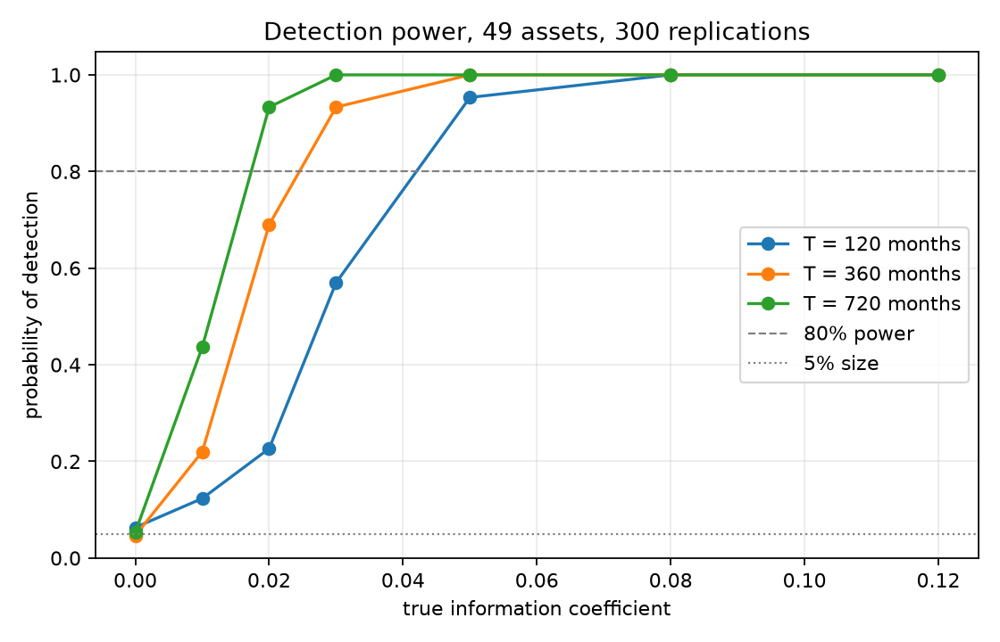
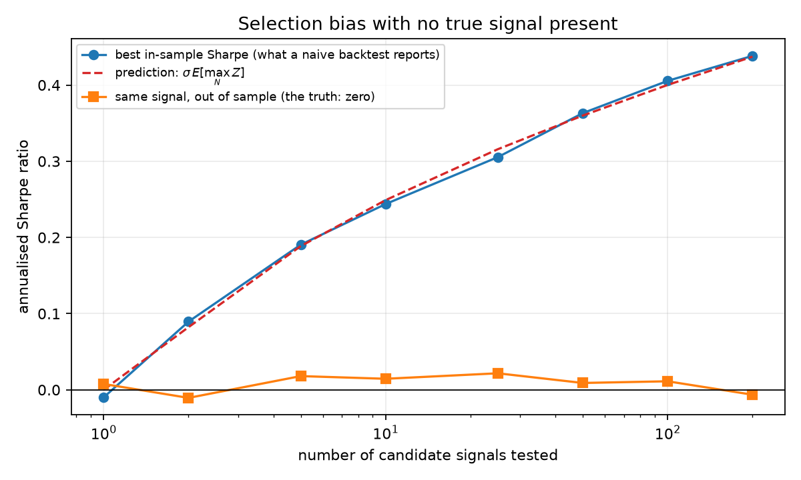
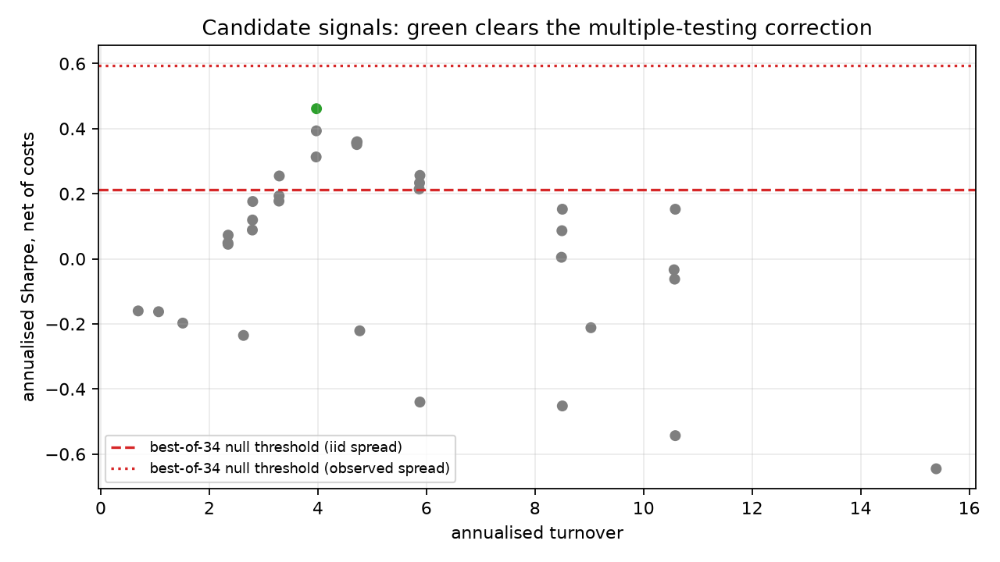

# How Much Does a Backtest Lie?

A calibrated framework for cross-sectional signal research under low signal-to-noise.

This is **not** a trading strategy. It is a study of a measurement problem: when you
search over many candidate signals, the best one looks good even when none of them
work. This project quantifies how much of an apparently strong backtest is real and
how much is selection bias.

The distinguishing idea is the order of operations. The research pipeline is first
validated on **synthetic data where the ground truth is known**, establishing both its
statistical power (can it find a signal that is really there?) and its false-discovery
behaviour (how often does it find one that is not?). Only then is the *unchanged*
pipeline applied to real market data.

## Headline result

Applied to 100 years of US industry returns with a sweep of 34 momentum, reversal and
volatility signals:

| Test applied | Signals declared significant |
|---|---:|
| Naive t-statistic > 2 | 28 of 34 |
| Benjamini-Hochberg, FDR 5% | 28 of 34 |
| Deflated Sharpe ratio, i.i.d. null | **1 of 34** |
| Deflated Sharpe ratio, observed trial dispersion | **0 of 34** |

The one survivor is 12-month industry momentum, which is a documented effect
(Moskowitz and Grinblatt, 1999). Everything else that looked significant was an
artefact of having tested 34 things.

---

## Experiment 1 — power and calibration

Synthetic panels of 49 assets, 300 replications per configuration, testing whether the
mean information coefficient is distinguishable from zero at the 5% level.

The first thing to check is the false-positive rate where the true IC is zero. It comes
out at **0.063, 0.047 and 0.053** for sample lengths of 120, 360 and 720 months against
a nominal 0.05. The pipeline is calibrated; without this, nothing downstream would be
trustworthy.

The power curve then answers the question that should precede every backtest: given the
data available, what is the weakest effect that could actually be detected?



Reaching 80% power requires a true IC of roughly **0.042 with 10 years of monthly data,
0.024 with 30 years, and 0.017 with 60 years**. Realistic cross-sectional signals have
ICs in the 0.02–0.05 range, so a ten-year backtest is underpowered for most of what one
would actually want to find. A null result on that sample size carries almost no
information.

## Experiment 2 — the cost of searching

Every candidate here has a true information coefficient of exactly zero, so there is
nothing to find. The pipeline nonetheless does what a researcher under deadline
pressure does: test N candidates on 480 months, keep the best Sharpe ratio, report it.
The remaining 240 months are held back to reveal the truth.



| Candidates tested | Best in-sample Sharpe | Predicted | Naive t-stat | Same signal, out of sample |
|---:|---:|---:|---:|---:|
| 1 | −0.010 | 0.000 | −0.06 | 0.008 |
| 10 | 0.244 | 0.249 | 1.54 | 0.014 |
| 50 | 0.363 | 0.360 | 2.30 | 0.009 |
| 200 | 0.438 | 0.437 | 2.77 | −0.006 |

Three things to take from this. The measured selection bias tracks the extreme-value
prediction \(\sigma \cdot E[\max_N Z]\) to within 4% for every N ≥ 5, across two orders
of magnitude. At 50 candidates the winner already carries a t-statistic above 2, which
clears every conventional single-test threshold. And the out-of-sample column stays flat at
zero throughout, which is what "the signal was worthless" looks like when you finally
measure it honestly.

The deflated Sharpe ratio rejects **100%** of these false discoveries at N ≥ 5.

## Experiment 3 — real data

Ken French's 49 industry portfolios, 1,202 months from July 1926 to August 2026.
Dollar-neutral rank portfolios, 10bp per unit of turnover.



The best candidate is 12-month momentum with no skip: annualised Sharpe **0.461**, mean
IC **0.071**, IC t-statistic **8.74**. Twenty-eight of the 34 candidates clear a naive
t > 2 bar, and all 28 also survive Benjamini-Hochberg, because BH corrects for the
false discovery rate among the tests performed but not for the fact that the whole
family was constructed by searching.

Deflation is where the candidates separate, and the choice of null dispersion matters
enough to report both:

- **i.i.d. null** (\(1/\sqrt{T}\), asking "could pure noise produce this?"): threshold
  0.213 annualised, and 12-month momentum survives with a deflated Sharpe of 0.980.
- **Observed trial dispersion** (Bailey and López de Prado's recommendation): threshold
  0.594 annualised, and nothing survives.

The second is the conservative choice and is right when trials are correlated. But it
over-corrects here, because the observed spread of the 34 Sharpes reflects genuine
differences between momentum and reversal rather than sampling noise. Using it assumes
away the effect it is being used to test for. That tension is not resolved in the
literature and it is worth stating rather than hiding behind whichever number is more
convenient.

Finally, a check that the survivor is not itself a selection artefact: on purged
walk-forward splits with a 36-month embargo, stitched out-of-sample P&L for 12-month
momentum gives a Sharpe of **0.612**, slightly *higher* than the full-sample 0.461.
That is what a real effect looks like.

---

## Why this design

Three choices are deliberate.

**Ken French industry portfolios rather than individual stocks.** Free stock data gives
you the *current* index members, so it carries survivorship bias: you are testing
signals on companies already known to have survived. The French portfolios are
constructed point-in-time and have no such bias. They are also small enough that every
experiment reruns in seconds, which matters more than it sounds — a slow pipeline is
one you stop checking.

**Purged and embargoed walk-forward splits rather than random k-fold.** Financial
panels are autocorrelated and signals overlap in time. Random cross-validation puts
adjacent, nearly identical observations in both the training and test sets, which leaks
information and inflates out-of-sample scores. Splits here are strictly chronological
with a gap between train and test.

**Deflated Sharpe ratio rather than a raw t-statistic.** A t-statistic answers "is this
signal distinguishable from noise?" for *one* pre-specified signal. It is the wrong
question after a search over 34, and experiment 3 shows exactly how wrong: 28 apparent
discoveries collapse to one.

## Structure

```text
src/synthetic.py     panel generator with controllable ground-truth IC
src/metrics.py       IC, Sharpe, standard errors, Newey-West, drawdown
src/portfolio.py     signal -> dollar-neutral weights -> net P&L with costs
src/validation.py    purged, embargoed walk-forward splits
src/selection.py     multiple-testing corrections, deflated Sharpe, permutation tests
src/data.py          Ken French industry portfolio loader
src/signals.py       the 34-candidate signal family
experiments/         the three studies above
tests/               60 tests; these are the specification
```

## Running

```bash
python -m pip install -r requirements.txt
python -m pytest tests -q
python experiments/01_power_study.py
python experiments/02_selection_bias.py
python experiments/03_real_data.py
```

Experiment 1 takes about a minute and experiment 2 about two; the rest are seconds.
Every result above is reproducible from these commands, and every random draw is
seeded.

Some tests are statistical rather than deterministic: permutation p-values are checked
for uniformity under the null with a Kolmogorov-Smirnov test, the Sharpe standard error
is checked against a 4,000-run simulation, and Benjamini-Hochberg is checked for actual
false-discovery-rate control over 600 synthetic families.

## Scope and limitations

Costs are a flat charge per unit of turnover, which ignores market impact entirely and
understates the cost of trading anything illiquid. The industry portfolios are
equal-weighted composites, not tradeable instruments, so the Sharpe ratios here are not
achievable returns. Nothing accounts for borrow constraints on the short leg. Turnover
is computed against previous target weights rather than drifted weights, which
understates it slightly.

The point is the measurement methodology, not a claim that any of these signals is
investable.
